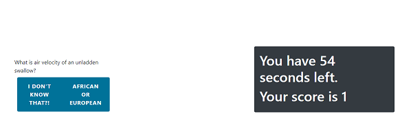

# Note Taker

## Description

A user can take a timed quiz that keeps score of correct answers and takes time off for every incorrect answer until the quiz is over or time runs out.

## Table of Contents

- [Usage](#usage)
- [Installation](#installation)
- [Tests](#tests)
- [License](#license)
- [Questions](#questions)

## Installation

Clone repo and npm install and init.

## Usage

Press start quiz button and select answers to submit them.

## License

This project is covered under the MIT license.

## Deployed app
[Quiz Application](https://kiasiri.github.io/Coding-Quiz/)

## Questions

You can contact me at:
--[Kiasiri](https://github.com/Kiasiri)
--Email: matthewwiessing@yahoo.com
